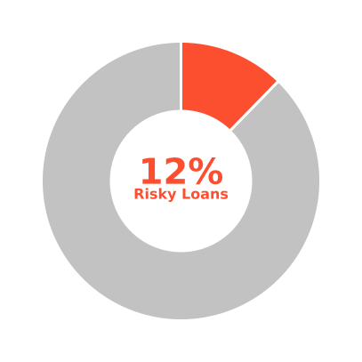
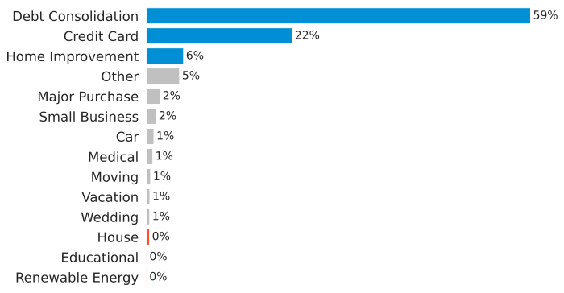
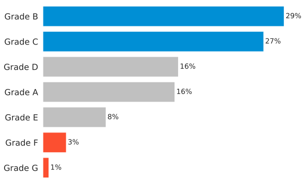
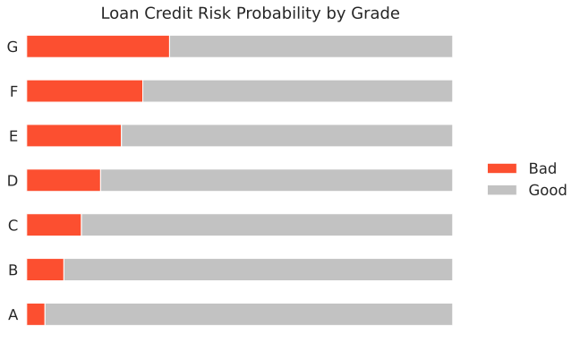
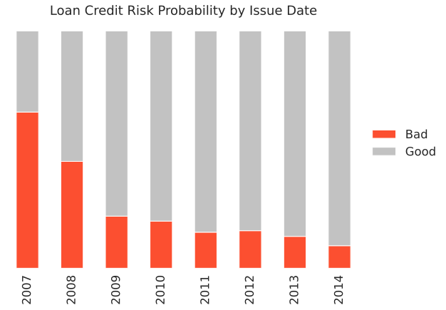
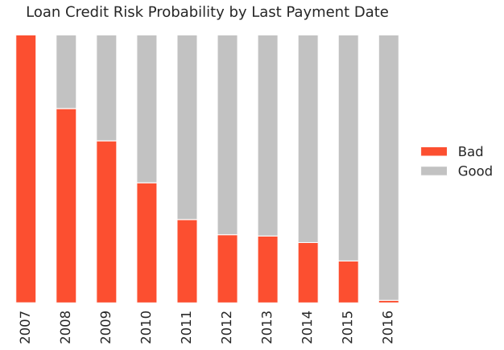
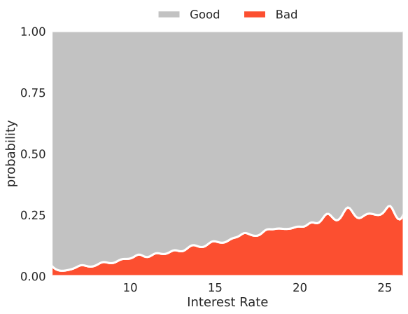
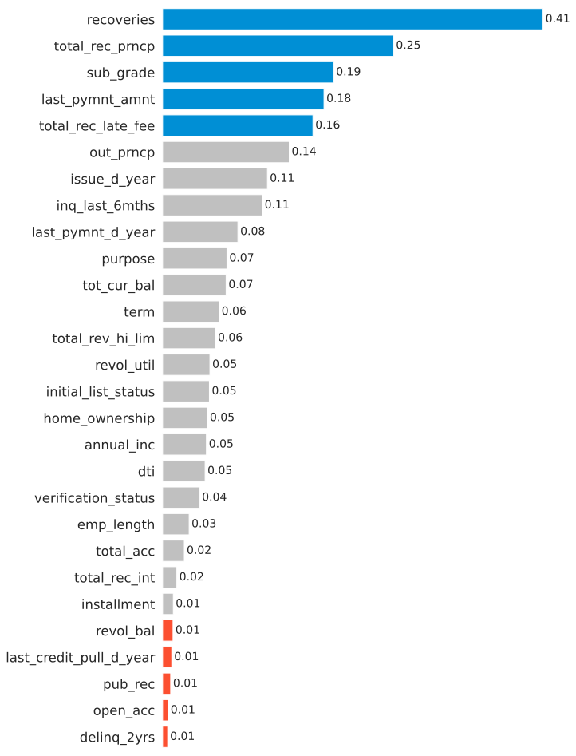
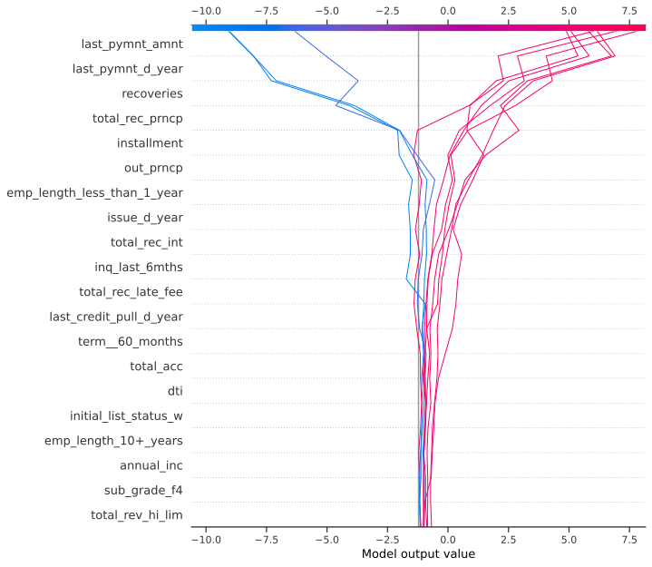

# LendingClub - Loan Credit Risk Prediction

This is my internship project as a data scientist at [id/x partners](https://idxpartners.com/)
  

In this project, I designed a predictive model to determine the probability of a borrower's default risk in a lending company and achieved a **98% accuracy score**.
  

## Project Notebooks

I create separated notebooks due to my limited computing resources
- [Exploratory Data Analysis](https://github.com/adhang/lendingclub-loan-credit-risk/blob/main/LendingClub_Loan_Credit_Risk_EDA.ipynb)
- [Machine Learning Modeling](https://github.com/adhang/lendingclub-loan-credit-risk/blob/main/LendingClub_Loan_Credit_Risk_Modeling_Clean.ipynb)
- [Download Project Infographic](https://adhang.github.io/pages/project-lendingclub-loan-credit-risk/project-infographic.pdf)

## Dataset & Business Understanding

**Dataset Information**
- This dataset contains borrowers information from a lending company, named [LendingClub](https://www.lendingclub.com/) (LC for short) from 2007 to 2014
- This company has various offerings such as loans, banking, and investments
  

**Attribute Information**
- Identifier
	- `id` - A unique LC assigned ID for the loan listing
	- `member_id` - A unique LC assigned ID for the borrower member

- Target Variable
	- `loan_status` - Current status of the loan, whether it's a good or bad (risky)

- More detailed attribute information can be found [here](https://resources.lendingclub.com/LCDataDictionary.xlsx)
  

**Company Goals** 
Increasing profit! But how can we achieve it? Some ways to increase profits are:
- Accepting applicants who will definitely pay off their loans
- Declining applicants who don't want to pay off the loan (potential to be defaulters)
  

**Problems**
- Credit risk is the possibility of a loss resulting from a borrower's failure to repay a loan or meet contractual obligations ([source](https://www.investopedia.com/terms/c/creditrisk.asp))
- When a lending company receives a loan application, the company has to make a decision whether the company will accept or decline based on the applicant's profile
- If the applicant is likely to pay off the loan but we don't approve their application, it may result in a loss of income for the company
- If the applicant is not likely to pay off the loan but we approve their application, it may result in financial loss for the company
  

**Objectives**
- Predict whether the borrower will pay off the loan or not
- Understanding the borrower behaviors:
  - What makes the borrower pay off the loan
  - What makes the borrower doesn't pay off the loan

## Exploratory Data Analysis

### What Happened?

The `Good` status is when the loan status is either `Current` or `Fully Paid`, otherwise the status is `Bad` (risky)

- There are 12% of borrowers who have a risky loan status
- Technically speaking, this dataset is an imbalanced dataset

### Who are The Borrowers?

- Many borrowers have the words `Manager`, `Service`, `Director`, `Assistant`, `Sale`, `Teacher`, or `Nurse` in their employment title
- Many borrowers didn't write their employment title, so it's marked as `Unknown`

### Why Did They Apply for a Loan?

- Most borrowers apply for loans for the purpose of debt consolidation

### What is Their Grade?

- Most borrowers have grade B and C

### Do Grades Matter?

- This feature seems to have a natural order based on the loan status probability
- Grade A has the highest probability to have a good loan status.
- Grade G has the lowest probability to have a good loan status

### Loan Credit Risk Probability by Date Features

#### Issue Date

- The earlier the issue date is, the higher the probability of a borrower to have a bad loan status

#### Last Payment Date

- If the last payment has been made a long time ago, then the probability of a borrower to have a bad loan status will be higher

### Do Interest Rates Matter?

- Borrowers with high-interest rates have a higher probability to have a bad loan status than those with a low-interest rate

### Attribute Associations to Loan Status

I did some feature selection based on:
- Feature cardinality  
	Feature with high cardinality was dropped
- Feature associations
	Feature with very low association (almost zero) to loan status was dropped
- Multicollinearity & redundant values
	Drop one (or more) of the highly correlated features
 

Below is the attribute associations to loan status after feature selection

## Data Preprocessing

I do some data preprocessing, such as:
- Imputing missing values
- Removing redundant features
- Reducing feature skewness
- Feature extraction
- Feature transformation (encoding, scaling)
- Oversampling with SMOTE

## Model Development

I use XGBoost and LightGBM for model development. Below are the metric scores for the model with the default hyperparameter. For simplicity reason, I only show the accuracy, F1 score, and harmonic mean of accuracy and F1 score.
  

<table id="T_769cb_" class="dataframe" style="width: auto;">
  <thead>
    <tr>
      <th class="blank" >&nbsp;</th>
      <th class="blank level0" >&nbsp;</th>
      <th class="col_heading level0 col0" style="width: 17%">Accuracy</th>
      <th class="col_heading level0 col1" style="width: 17%">F1 Score</th>
      <th class="col_heading level0 col2" style="width: 18%">Harmonic Mean</th>
    </tr>
    <!-- <tr>
      <th class="index_name level0" >Model</th>
      <th class="index_name level1" >Feature Selection</th>
      <th class="blank col0" >&nbsp;</th>
      <th class="blank col1" >&nbsp;</th>
      <th class="blank col2" >&nbsp;</th>
    </tr> -->
  </thead>
  <tbody class="lendingclub-table-body">
    <tr>
      <th id="T_769cb_level0_row0" class="row_heading level0 row0" rowspan="4">XGBoost</th>
      <th id="T_769cb_level1_row0" class="row_heading level1 row0" >Using All Features</th>
      <td id="T_769cb_row0_col0" class="data row0 col0" >0.950</td>
      <td id="T_769cb_row0_col1" class="data row0 col1" >0.809</td>
      <td id="T_769cb_row0_col2" class="data row0 col2" >0.874</td>
    </tr>
    <tr>
      <th id="T_769cb_level1_row1" class="row_heading level1 row1" >Using 75% Features</th>
      <td id="T_769cb_row1_col0" class="data row1 col0" >0.943</td>
      <td id="T_769cb_row1_col1" class="data row1 col1" >0.792</td>
      <td id="T_769cb_row1_col2" class="data row1 col2" >0.861</td>
    </tr>
    <tr>
      <th id="T_769cb_level1_row2" class="row_heading level1 row2" >Using 50% Features</th>
      <td id="T_769cb_row2_col0" class="data row2 col0" >0.922</td>
      <td id="T_769cb_row2_col1" class="data row2 col1" >0.740</td>
      <td id="T_769cb_row2_col2" class="data row2 col2" >0.821</td>
    </tr>
    <tr>
      <th id="T_769cb_level1_row3" class="row_heading level1 row3" >Using 25% Features</th>
      <td id="T_769cb_row3_col0" class="data row3 col0" >0.905</td>
      <td id="T_769cb_row3_col1" class="data row3 col1" >0.700</td>
      <td id="T_769cb_row3_col2" class="data row3 col2" >0.789</td>
    </tr>
    <tr>
      <th id="T_769cb_level0_row4" class="row_heading level0 row4" rowspan="4">LightGBM</th>
      <th id="T_769cb_level1_row4" class="row_heading level1 row4" >Using All Features</th>
      <td id="T_769cb_row4_col0" class="data row4 col0" >0.974</td>
      <td id="T_769cb_row4_col1" class="data row4 col1" >0.882</td>
      <td id="T_769cb_row4_col2" class="data row4 col2" >0.926</td>
    </tr>
    <tr>
      <th id="T_769cb_level1_row5" class="row_heading level1 row5" >Using 75% Features</th>
      <td id="T_769cb_row5_col0" class="data row5 col0" >0.974</td>
      <td id="T_769cb_row5_col1" class="data row5 col1" >0.883</td>
      <td id="T_769cb_row5_col2" class="data row5 col2" >0.926</td>
    </tr>
    <tr>
      <th id="T_769cb_level1_row6" class="row_heading level1 row6" >Using 50% Features</th>
      <td id="T_769cb_row6_col0" class="data row6 col0" >0.969</td>
      <td id="T_769cb_row6_col1" class="data row6 col1" >0.865</td>
      <td id="T_769cb_row6_col2" class="data row6 col2" >0.914</td>
    </tr>
    <tr>
      <th id="T_769cb_level1_row7" class="row_heading level1 row7" >Using 25% Features</th>
      <td id="T_769cb_row7_col0" class="data row7 col0" >0.955</td>
      <td id="T_769cb_row7_col1" class="data row7 col1" >0.822</td>
      <td id="T_769cb_row7_col2" class="data row7 col2" >0.884</td>
    </tr>
  </tbody>
</table>

  
Overall, the LightGBM model performs better than the XGBoost model. What if we do some tuning for the hyperparameters?

## Model Optimization

I use Optuna for hyperparameter tuning. My tuning strategy follows business goals:
- I want to avoid high false negatives in the risky class to minimize financial loss, therefore I have to maximize the recall score
- However, I also want to avoid high false positives in the risky class to minimize the loss of income, therefore I have to maximize the precision score as well
- To overcome these conditions, I will optimize the F1 score because it is the harmonic mean of precision and recall
- I use the F1 score from the negative class because I give more attention to optimizing the metrics for bad loan status
- I'm still paying attention to the accuracy score as well since this metric is easier to interpret

  

<table id="T_31771_" class="dataframe" style="width: auto;">
  <thead>
    <tr>
      <th class="blank" >&nbsp;</th>
      <th class="blank level0" >&nbsp;</th>
      <th class="col_heading level0 col0" style="width: 17%">Accuracy</th>
      <th class="col_heading level0 col1" style="width: 17%">F1 Score</th>
      <th class="col_heading level0 col2" style="width: 18%">Harmonic Mean</th>
    </tr>
    <!-- <tr>
      <th class="index_name level0" >Model</th>
      <th class="index_name level1" >Feature Selection</th>
      <th class="blank col0" >&nbsp;</th>
      <th class="blank col1" >&nbsp;</th>
      <th class="blank col2" >&nbsp;</th>
    </tr> -->
  </thead>
  <tbody class="lendingclub-table-body">
    <tr>
      <th id="T_31771_level0_row0" class="row_heading level0 row0" rowspan="4">XGBoost</th>
      <th id="T_31771_level1_row0" class="row_heading level1 row0" >Using All Features</th>
      <td id="T_31771_row0_col0" class="data row0 col0" >0.971</td>
      <td id="T_31771_row0_col1" class="data row0 col1" >0.875</td>
      <td id="T_31771_row0_col2" class="data row0 col2" >0.921</td>
    </tr>
    <tr>
      <th id="T_31771_level1_row1" class="row_heading level1 row1" >Using 75% Features</th>
      <td id="T_31771_row1_col0" class="data row1 col0" >0.971</td>
      <td id="T_31771_row1_col1" class="data row1 col1" >0.876</td>
      <td id="T_31771_row1_col2" class="data row1 col2" >0.921</td>
    </tr>
    <tr>
      <th id="T_31771_level1_row2" class="row_heading level1 row2" >Using 50% Features</th>
      <td id="T_31771_row2_col0" class="data row2 col0" >0.969</td>
      <td id="T_31771_row2_col1" class="data row2 col1" >0.867</td>
      <td id="T_31771_row2_col2" class="data row2 col2" >0.915</td>
    </tr>
    <tr>
      <th id="T_31771_level1_row3" class="row_heading level1 row3" >Using 25% Features</th>
      <td id="T_31771_row3_col0" class="data row3 col0" >0.955</td>
      <td id="T_31771_row3_col1" class="data row3 col1" >0.826</td>
      <td id="T_31771_row3_col2" class="data row3 col2" >0.886</td>
    </tr>
    <tr>
      <th id="T_31771_level0_row4" class="row_heading level0 row4" rowspan="4">LightGBM</th>
      <th id="T_31771_level1_row4" class="row_heading level1 row4" >Using 100% Features</th>
      <td id="T_31771_row4_col0" class="data row4 col0" >0.975</td>
      <td id="T_31771_row4_col1" class="data row4 col1" >0.891</td>
      <td id="T_31771_row4_col2" class="data row4 col2" >0.931</td>
    </tr>
    <tr>
      <th id="T_31771_level1_row5" class="row_heading level1 row5" >Using 75% Features</th>
      <td id="T_31771_row5_col0" class="data row5 col0" >0.975</td>
      <td id="T_31771_row5_col1" class="data row5 col1" >0.890</td>
      <td id="T_31771_row5_col2" class="data row5 col2" >0.931</td>
    </tr>
    <tr>
      <th id="T_31771_level1_row6" class="row_heading level1 row6" >Using 50% Features</th>
      <td id="T_31771_row6_col0" class="data row6 col0" >0.972</td>
      <td id="T_31771_row6_col1" class="data row6 col1" >0.877</td>
      <td id="T_31771_row6_col2" class="data row6 col2" >0.922</td>
    </tr>
    <tr>
      <th id="T_31771_level1_row7" class="row_heading level1 row7" >Using 25% Features</th>
      <td id="T_31771_row7_col0" class="data row7 col0" >0.963</td>
      <td id="T_31771_row7_col1" class="data row7 col1" >0.850</td>
      <td id="T_31771_row7_col2" class="data row7 col2" >0.903</td>
    </tr>
  </tbody>
</table>
  

## Conclusion

**Final Model**  
LightGBM using 75% features and get:
- Accuracy: 98%
- F1 Score: 89%
  

**Recommendation and Request**  
- We should pay more attention to borrowers who meet the criteria below
  - Earlier issue date
  - High interest rate
- Evaluate and do some adjustment to the interest rate. Maybe we can adjust the interest rate based on borrowers' default risk probability.
- Use targeted ads for potential new borrowers based on their needs and occupations

## Explainable AI

SHAP (SHapley Additive exPlanations) is a game theoretic approach to explain the output of any machine learning model.
  
See [papers](https://github.com/slundberg/shap#citations) for details and citations.
  
