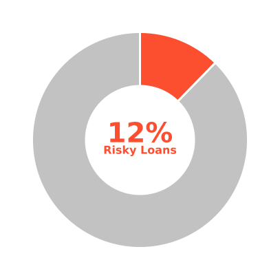
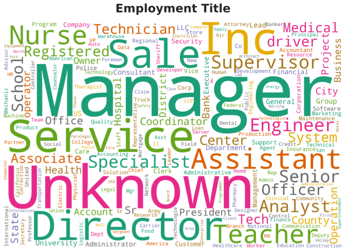
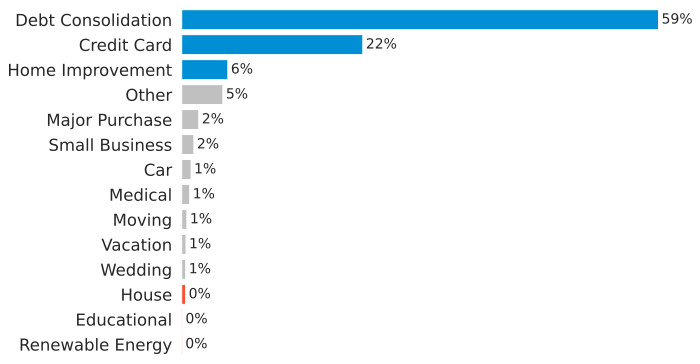
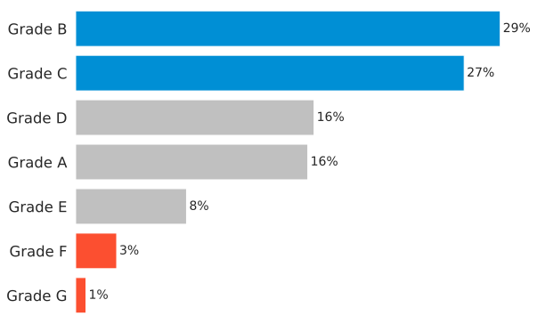
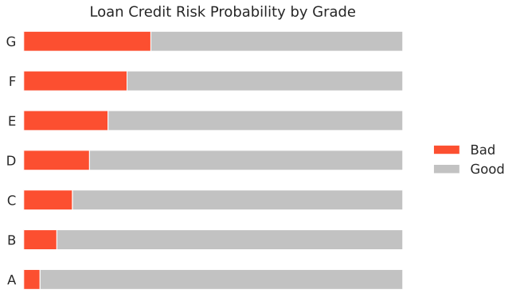
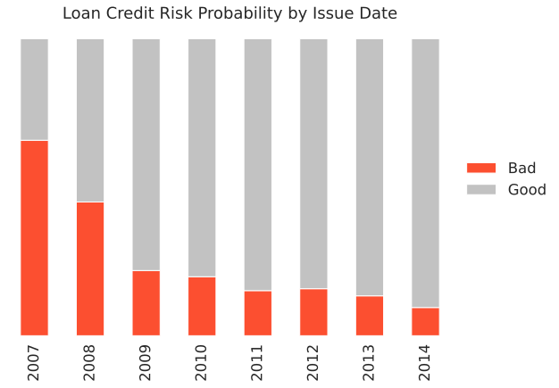
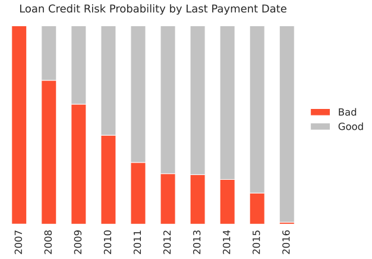
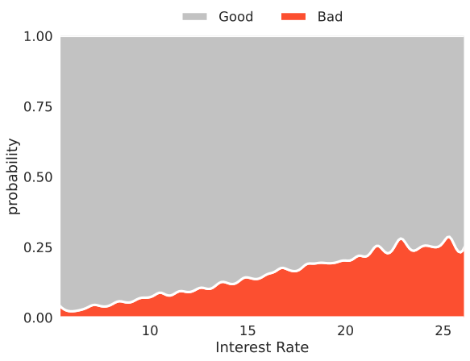

# LendingClub - Loan Credit Risk Prediction

This is my internship project as a data scientist at [id/x partners](https://idxpartners.com/)
  

In this project, I designed a predictive model to determine the probability that loan borrowers will have a good or bad (risky) loan status at a lending company with **98% accuracy**.
  

Note: This project is still on-going, will update later.

## Project Notebooks

I create separated notebooks due to my limited computing resources
- [Exploratory Data Analysis](https://github.com/adhang/learn-data-science/blob/main/LendingClub_Loan_Credit_EDA.ipynb)
- [Machine Learning Modeling](https://github.com/adhang/learn-data-science/blob/main/LendingClub_Loan_Credit.ipynb)

## Dataset & Business Understanding

**Dataset Information**
- This dataset contains borrowers information from a lending company, named [LendingClub](https://www.lendingclub.com/) (LC for short) from 2007 to 2014
- This company has various offerings such as borrowing, banking, and investing
  

**Attribute Information**
- Identifier
	- `id` - A unique LC assigned ID for the loan listing
	- `member_id` - A unique LC assigned ID for the borrower member

- Target Variable
	- `loan_status` - Current status of the loan, whether it's a good or bad (risky)

- More detailed attribute information can be found [here](https://resources.lendingclub.com/LCDataDictionary.xlsx)
  

**Company Goals** 
Increasing profit! But how can we achieve it? Some ways to increase profits are:
- Accepting applicants who will definitely pay off their loans
- Declining applicants who don't want to pay off the loan (potential to be defaulters)
  

**Problems**
- When a lending company receives a loan application, the company has to make a decision whether the company will accept or decline based on the applicant's profile
- If the applicant is likely to pay off the loan but we don't approve their application, it may result in a loss of income for the company
- If the applicant is not likely to pay off the loan but we approve their application, it may result in financial loss for the company
  

**Objectives**
- Predict whether the borrower will pay off the loan or not
- Understanding the borrower behaviors:
  - What makes the borrower pay off the loan
  - What makes the borrower doesn't pay off the loan

## Exploratory Data Analysis

### What Happened?

The `Good` status is when the loan status is either `Current` or `Fully Paid`, otherwise the status is `Bad` (risky)

- There are 12% of borrowers who have a risky loan status
- Technically speaking, this dataset is an imbalanced dataset

### Who are The Borrowers?

- Many borrowers have the words `Manager`, `Service`, `Director`, `Assistant`, `Sale`, `Teacher`, or `Nurse` in their employment title
- Many borrowers didn't write their employment title, so it's marked as `Unknown`

### Why Did They Apply for a Loan?

- Most borrowers apply for loans for the purpose of debt consolidation

### What is Their Grade?

- Most borrowers have grade B and C

### Do Grades Matter?

- The grade feature has a natural order based on the loan status probability
- Grade A has the highest probability to have a good loan status.
- Grade G has the lowest probability to have a good loan status

### Loan Credit Risk Probability by Date Features

#### Issue Date

- The earlier the issue date is, the higher the probability of a borrower to have a bad loan status

#### Last Payment Date

- If the last payment has been made a long time ago, then the probability of a borrower to have a bad loan status will be higher

### Do Interest Rates Matter?

- Borrowers with high-interest rates have a higher probability to have a bad loan status than those with a low-interest rate

## Data Preprocessing

## Model Development & Evaluation

## Model Optimization

## Conclusion

## Explainable AI

## Model Deployment
