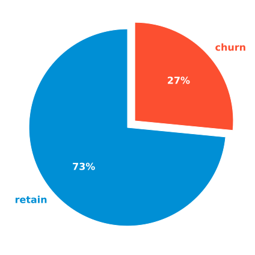
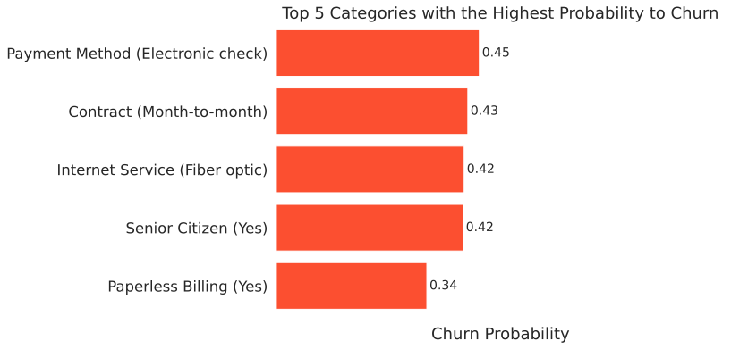
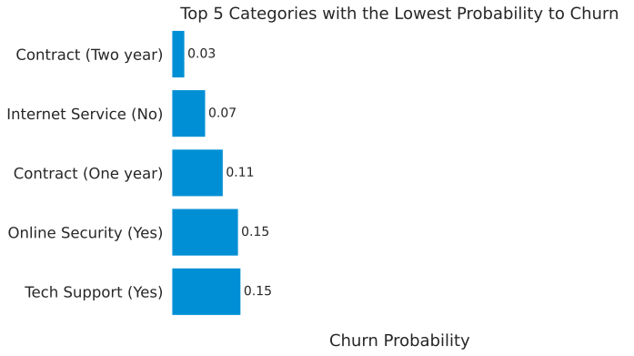
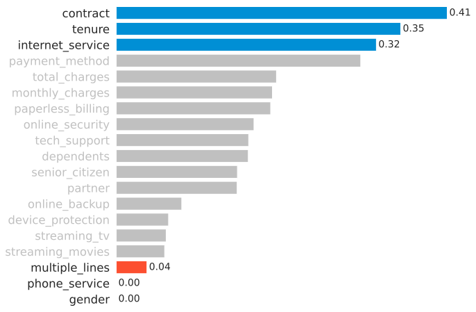
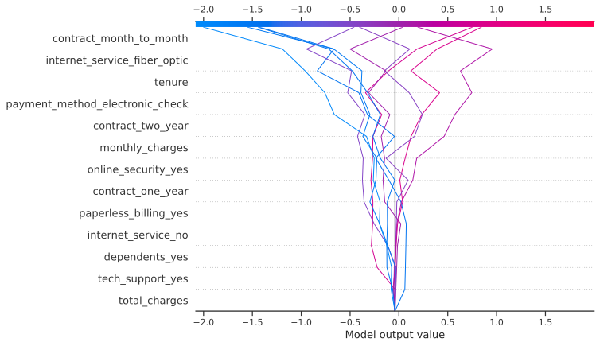
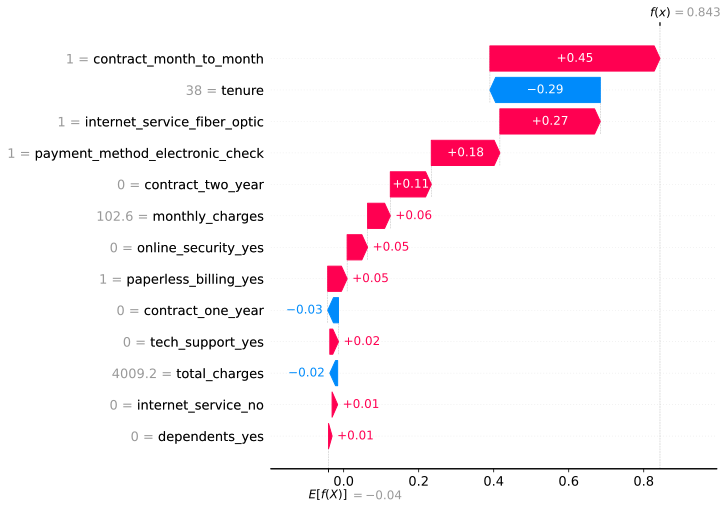

# Telco Customer Churn Prediction

In this project, I designed a predictive model to determine the probability that customers will leave the service (churn) or continue to use the service (retain) at a telco company. In working on this project, I used a workflow based on the CRISP-DM model, starting from business understanding, data understanding, data preparation, modeling, evaluation, and deployment.

## Dataset & Business Understanding

**Dataset Information**
- This dataset contains customer information from a fictional telco company
- This company provides various services such as streaming, phone, and internet services
  

**Attribute Information**
- Identifier
  - `customerID` - ID number of the customer

- Target Variable
  - `Churn` - Churn status, whether the customer churned or not

- Demographic information
  - `gender` - Whether the customer is a male or a female
  - `SeniorCitizen` - Whether the customer is a senior citizen or not
  - `Partner` - Whether the customer has a partner or not
  - `Dependents` - Whether the customer has dependents or not

- Customer account information
  - `tenure` - Number of months the customer has used the service
  - `Contract` - The contract term of the customer
  - `PaperlessBilling` - Whether the customer has paperless billing or not
  - `PaymentMethod` - The customer’s payment method
  - `MonthlyCharges` - The amount charged to the customer monthly
  - `TotalCharges` - The total amount charged to the customer
  
- Services that each customer has signed up for
  - `PhoneService` - Whether the customer has a phone service or not
  - `MultipleLines` - Whether the customer has multiple lines or not
  - `InternetService` - Customer’s internet service provider
  - `OnlineSecurity` - Whether the customer has online security or not
  - `OnlineBackup` - Whether the customer has online backup or not
  - `DeviceProtection` - Whether the customer has device protection or not
  - `TechSupport` - Whether the customer has tech support or not
  - `StreamingTV` - Whether the customer has streaming TV or not
  - `StreamingMovies` - Whether the customer has streaming movies or not

Note: Since this dataset is using `CamelCase` format for the column names, for this project, I will convert it to `snake_case` format.
  

**Company Goals** 
Increasing profit! But how can we achieve it? Some of the way to increase profit are:
- Acquiring new customers as much as we can
- Retaining existing customers as much as we can
  

**Problems**
- Companies need to invest (expense costs) to get new customers
- When a customer leaves the service (churns), it indicates a loss of investment
- Cost, time, and effort need to be channelled to replace customers who have left the service
- Acquiring new customers is often more difficult and more expensive than retaining existing customers
- On Hardvard Business Review [page](https://hbr.org/2014/10/the-value-of-keeping-the-right-customers), they said: acquiring a new customer is anywhere from five to 25 times more expensive than retaining an existing one
  

**Objectives**
- Predict whether customers will continue to use the service or will leave the service
- Understanding the customer behaviors:
  - What keeps customers using the service
  - What makes customers leave the service

## Exploratory Data Analysis

### What Happened?

27% customers leave us!

### Top 5 Churn Probability

### Top 5 Retain Probability

### Attribute Associations to Churn Status

## Data Preprocessing

I do some data preprocessing, such as:
- Imputing missing values
- Removing redundant values
- Train - test split
- Feature encoding
- Feature scaling
- Oversampling with SMOTE

## Model Development & Evaluation

I tried several machine learning algorithms, such as:
- Logistic regression
- Ridge classifier
- KNN
- SVC
- Neural network
- Decision tree
- Random forest
- Gradient boosting classifier
- AdaBoost classifier
- CatBoost classifier
- Hist gradient boosting classifier
- XGBoost
- LightGBM
  

Overall, boosting methods show a good performance. Then, I tried to compare some feature selection methods and hyperparameter tuning to see if the performance of boosting methods can be improved.
  
My tuning strategy focuses on optimizing the positive recall value (not the average) to minimize the occurrence of false negatives, which is when we incorrectly predict customers who actually churn as non-churn. This is because the cost of acquiring new customers is more expensive than retaining existing customers. But, I still pay attention to the accuracy score as well.
  
To do model selection, I use the harmonic mean (F-beta) of accuracy and recall.
  

<table id="T_be2f1_">
  <thead>
    <tr>
      <th class="blank level0" >&nbsp;</th>
      <th class="col_heading level0 col0" style="width: 15%">accuracy</th>
      <th class="col_heading level0 col1" style="width: 15%">recall</th>
      <th class="col_heading level0 col2" style="width: 15%">fbeta</th>
    </tr>
    <tr>
      <th class="index_name level0" style="text-align: right;">model</th>
      <th class="blank col0" >&nbsp;</th>
      <th class="blank col1" >&nbsp;</th>
      <th class="blank col2" >&nbsp;</th>
    </tr>
  </thead>
  <tbody class="telco-table-body">
    <tr>
      <th id="T_be2f1_level0_row0" class="row_heading level0 row0">Gradient Boosting Classifier</th>
      <td id="T_be2f1_row0_col0" class="data row0 col0" >0.775</td>
      <td id="T_be2f1_row0_col1" class="data row0 col1" >0.766</td>
      <td id="T_be2f1_row0_col2" class="data row0 col2" >0.771</td>
    </tr>
    <tr>
      <th id="T_be2f1_level0_row1" class="row_heading level0 row1">AdaBoost Classifier</th>
      <td id="T_be2f1_row1_col0" class="data row1 col0" >0.759</td>
      <td id="T_be2f1_row1_col1" class="data row1 col1" >0.783</td>
      <td id="T_be2f1_row1_col2" class="data row1 col2" >0.770</td>
    </tr>
    <tr>
      <th id="T_be2f1_level0_row2" class="row_heading level0 row2">CatBoost Classifier</th>
      <td id="T_be2f1_row2_col0" class="data row2 col0" >0.761</td>
      <td id="T_be2f1_row2_col1" class="data row2 col1" >0.765</td>
      <td id="T_be2f1_row2_col2" class="data row2 col2" >0.763</td>
    </tr>
    <tr>
      <th id="T_be2f1_level0_row3" class="row_heading level0 row3">Hist Gradient Boosting</th>
      <td id="T_be2f1_row3_col0" class="data row3 col0" >0.756</td>
      <td id="T_be2f1_row3_col1" class="data row3 col1" >0.781</td>
      <td id="T_be2f1_row3_col2" class="data row3 col2" >0.768</td>
    </tr>
    <tr>
      <th id="T_be2f1_level0_row4" class="row_heading level0 row4">XGBoost</th>
      <td id="T_be2f1_row4_col0" class="data row4 col0" >0.761</td>
      <td id="T_be2f1_row4_col1" class="data row4 col1" >0.779</td>
      <td id="T_be2f1_row4_col2" class="data row4 col2" >0.770</td>
    </tr>
    <tr>
      <th id="T_be2f1_level0_row5" class="row_heading level0 row5">LightGBM</th>
      <td id="T_be2f1_row5_col0" class="data row5 col0" >0.762</td>
      <td id="T_be2f1_row5_col1" class="data row5 col1" >0.791</td>
      <td id="T_be2f1_row5_col2" class="data row5 col2" >0.777</td>
    </tr>
  </tbody>
</table>

## Conclusion

**Final Model** 
LightGBM with feature selection using filter method and get:
- Accuracy: 76.2%
- Positive recall: 79.1%
  

**Recommendation and Request** 
- We should pay more attention to customers who meet the criteria below
  - Contract: Month-to-month
  - Tenure: Short tenure
  - Internet service: Fiber optic
  - Payment method: Electronic check

- Please, evaluate our service!  
  Especially for internet service (fiber optic) and payment method (electronic check)
- Can we give more benefit to a new customer?  
Because the new customer has a high probability to churn

## Explainable AI

SHAP (SHapley Additive exPlanations) is a game theoretic approach to explain the output of any machine learning model.
  
See [papers](https://github.com/slundberg/shap#citations) for details and citations.

### Decision Plot

### Waterfall Plot

## Model Deployment

I had deployed my model on a web app using Flask and Heroku. You can try it [here](https://adhang-churn.herokuapp.com/)

## Notebook

You can find the detailed project on my [GitHub](https://github.com/adhang/data-science-digital-skola) or [Kaggle](https://www.kaggle.com/adhang/telco-customer-churn-prediction-complete-guide)