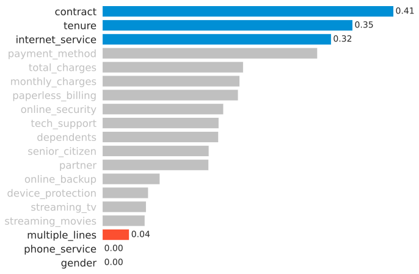
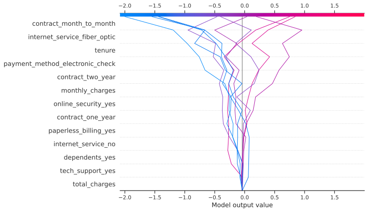

# Telco Customer Churn Prediction

## Dataset & Business Understanding

**Dataset Information**
- This dataset contains customer information from a fictional telco company
- This company provides various services such as streaming, phone, and internet services
  

**Attribute Information**
- Identifier
  - `customerID` - ID number of the customer

- Target Variable
  - `Churn` - Churn status, whether the customer churned or not

- Demographic information
  - `gender` - Whether the customer is a male or a female
  - `SeniorCitizen` - Whether the customer is a senior citizen or not
  - `Partner` - Whether the customer has a partner or not
  - `Dependents` - Whether the customer has dependents or not

- Customer account information
  - `tenure` - Number of months the customer has used the service
  - `Contract` - The contract term of the customer
  - `PaperlessBilling` - Whether the customer has paperless billing or not
  - `PaymentMethod` - The customer’s payment method
  - `MonthlyCharges` - The amount charged to the customer monthly
  - `TotalCharges` - The total amount charged to the customer
  
- Services that each customer has signed up for
  - `PhoneService` - Whether the customer has a phone service or not
  - `MultipleLines` - Whether the customer has multiple lines or not
  - `InternetService` - Customer’s internet service provider
  - `OnlineSecurity` - Whether the customer has online security or not
  - `OnlineBackup` - Whether the customer has online backup or not
  - `DeviceProtection` - Whether the customer has device protection or not
  - `TechSupport` - Whether the customer has tech support or not
  - `StreamingTV` - Whether the customer has streaming TV or not
  - `StreamingMovies` - Whether the customer has streaming movies or not

Note: Since this dataset is using `CamelCase` format for the column names, for this project, I will convert it to `snake_case` format.
  

**Company Goals** 
Increasing profit! But how can we achieve it? Some of the way to increase profit are:
- Acquiring new customers as much as we can
- Retaining existing customers as much as we can
  

**Problems**
- Companies need to invest (expense costs) to get new customers
- When a customer leaves the service (churns), it indicates a loss of investment
- Cost, time, and effort need to be channelled to replace customers who have left the service
- Acquiring new customers is often more difficult and more expensive than retaining existing customers
- On Hardvard Business Review [page](https://hbr.org/2014/10/the-value-of-keeping-the-right-customers), they said: acquiring a new customer is anywhere from five to 25 times more expensive than retaining an existing one
  

**Objectives**
- Predict whether customers will continue to use the service or will leave the service
- Understanding the customer behaviors:
  - What keeps customers using the service
  - What makes customers leave the service

## Exploratory Data Analysis

### What Happened?

27% customers leave us!

### Top 5 Churn Probability

### Top 5 Retain Probability

### Attribute Associations to Churn Status

## Data Preprocessing

I do some data preprocessing, such as:
- Imputing missing values
- Removing redundant values
- Train - test split
- Feature encoding
- Feature scaling
- Oversampling with SMOTE

## Model Development & Evaluation

## Conclusion

**Final Model** 
LightGBM with feature selection using filter method
  
**Recommendation and Request** 
- We should pay more attention to customers who meet the criteria below
  - Contract: Month-to-month
  - Tenure: Short tenure
  - Internet service: Fiber optic
  - Payment method: Electronic check

- Please, evaluate our service!  
  Especially for internet service (fiber optic) and payment method (electronic check)
- Can we give more benefit to a new customer?  
Because the new customer has a high probability to churn

## Explainable AI

SHAP (SHapley Additive exPlanations) is a game theoretic approach to explain the output of any machine learning model.
  
See [papers](https://github.com/slundberg/shap#citations) for details and citations.

### Decision Plot

### Waterfall Plot

## Model Deployment

I had deployed my model on a web app using Flask and Heroku. You can try it [here](https://adhang-churn.herokuapp.com/)

